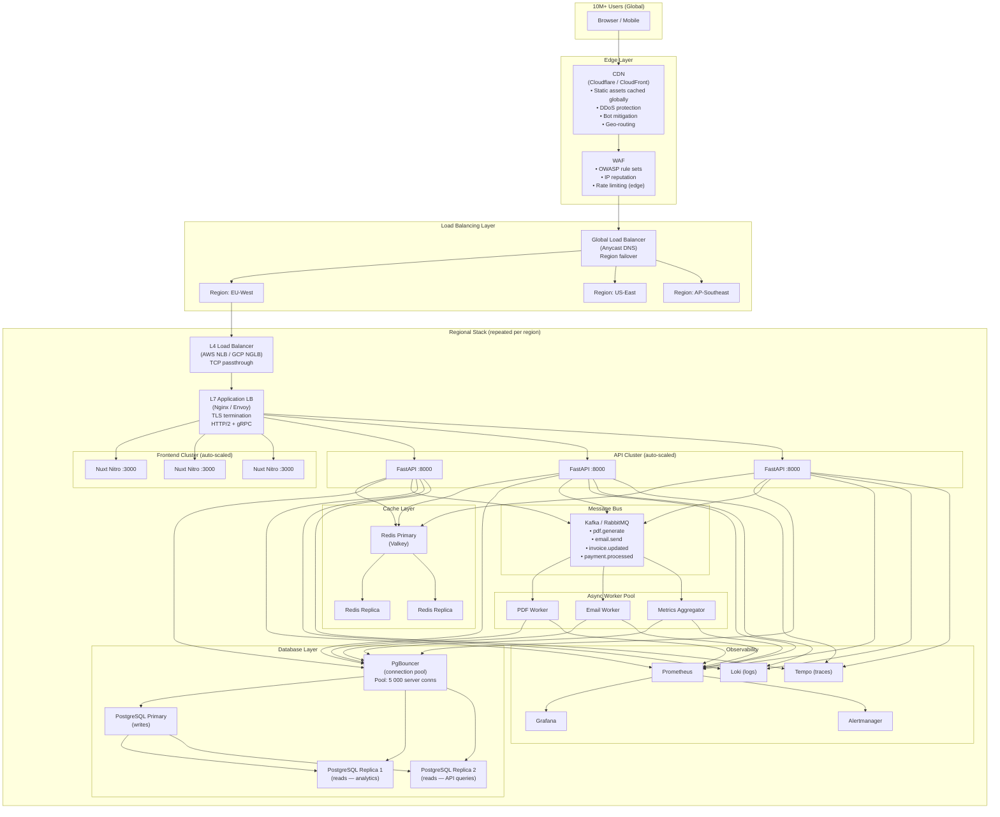
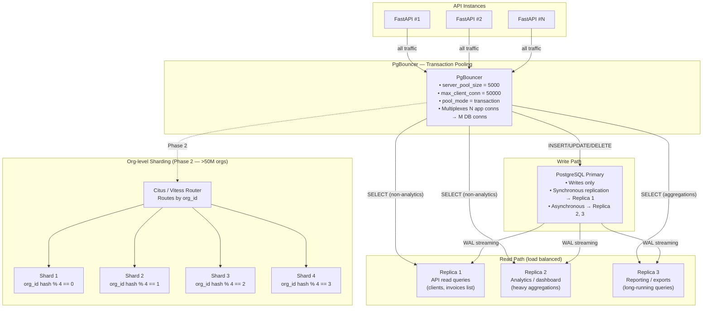
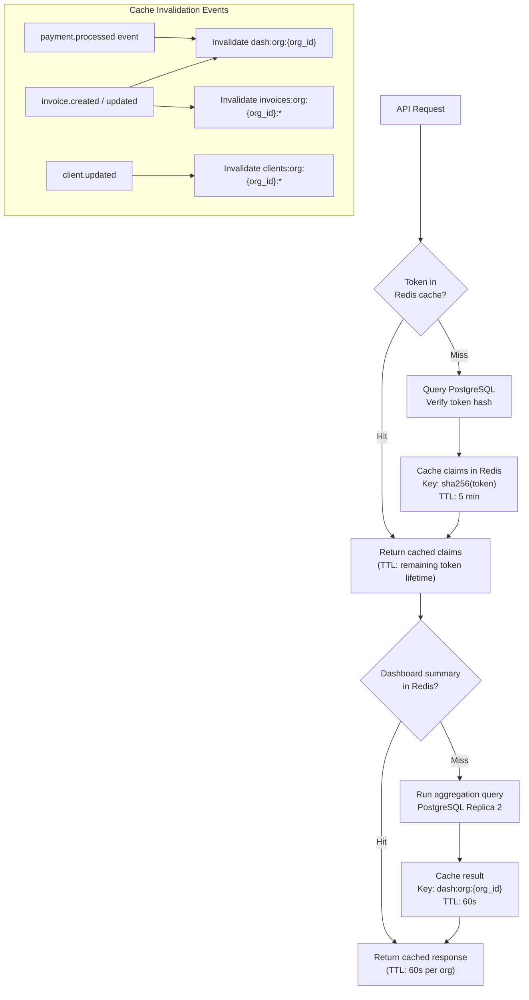
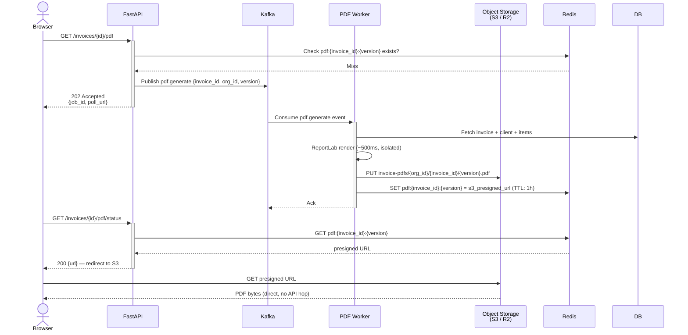
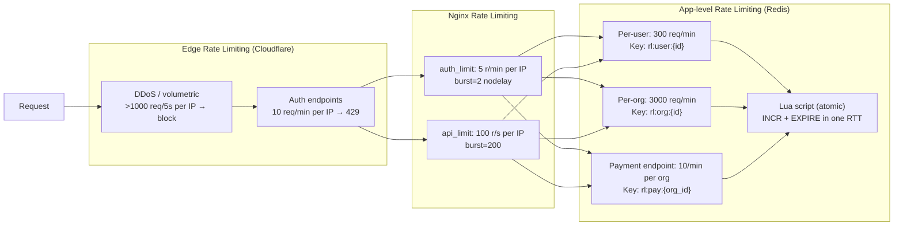
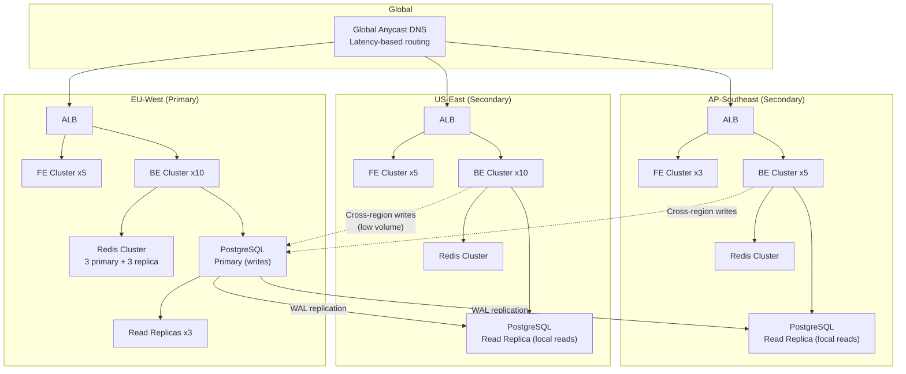
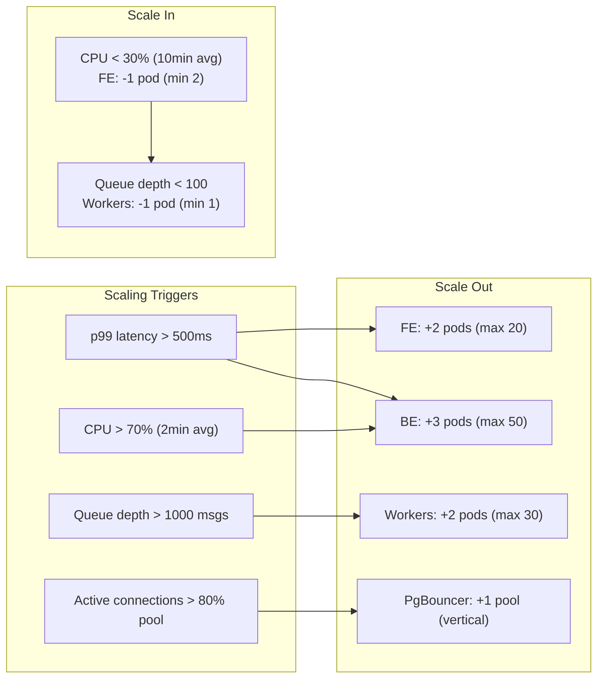
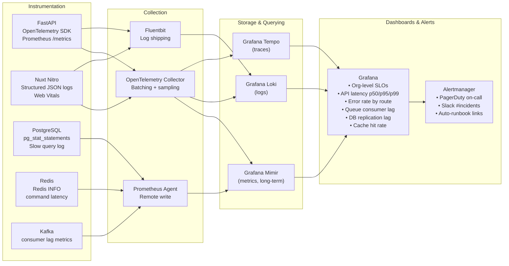
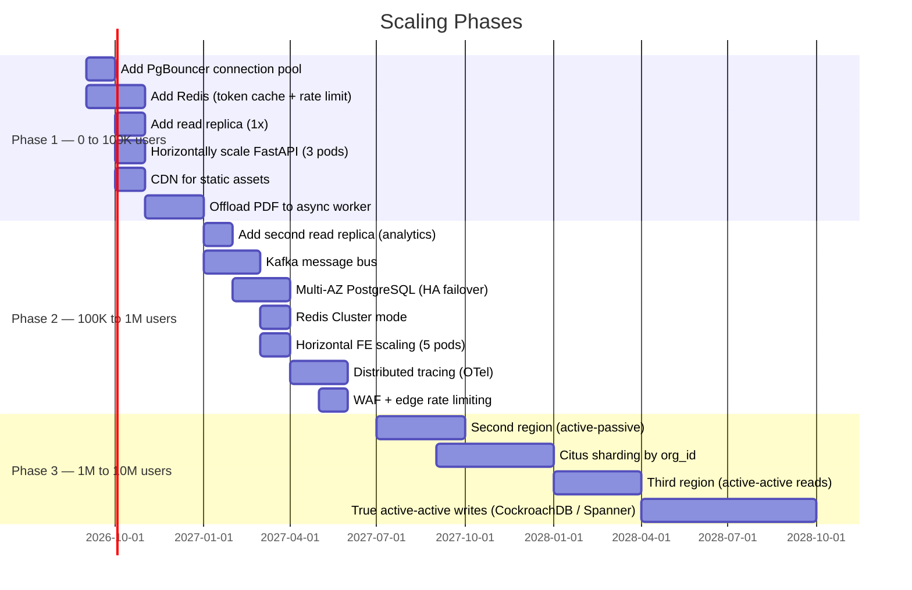

# Invoice Tracker — Scalability Architecture (10M+ Users)

## Current Bottlenecks (Baseline)

| Component | Current Limit | Reason |
|---|---|---|
| Single PostgreSQL instance | ~500 concurrent connections | No pooling layer, no replicas |
| Single FastAPI container | ~2 000 req/s | No horizontal scaling |
| Single Nginx | ~10 000 req/s | No CDN, no L4 load balancer |
| Synchronous PDF rendering | Blocks request thread | ReportLab blocks event loop |
| In-process rate limiting | Not shared across instances | slowapi state is per-process |
| No caching | Every dashboard hit = full DB scan | Raw SQL aggregations every request |
| Refresh token lookup | Full-table hash scan | No Redis; hits PostgreSQL every request |

---

## 1. Target Architecture Overview



---

## 2. Database Scaling Strategy



### Read/Write Routing Rules

| Query Type | Route | Reason |
|---|---|---|
| `INSERT`, `UPDATE`, `DELETE` | Primary | Consistency required |
| `SELECT` invoices list / clients | Replica 1 | Low latency, high volume |
| `SELECT` dashboard aggregations | Replica 2 | Isolated from API traffic |
| `SELECT` PDF data (invoice + items) | Replica 1 | Read-only snapshot |
| `SELECT ... FOR UPDATE` (payments) | Primary | Requires write lock |
| Auth token lookups | Redis first → Primary fallback | Avoid DB on hot path |

---

## 3. Caching Strategy (Redis / Valkey)



### Cache Key Taxonomy

| Key Pattern | TTL | Contents |
|---|---|---|
| `token:claims:{sha256}` | Remaining token lifetime | JWT claims dict (no secret) |
| `dash:org:{org_id}` | 60s | Dashboard summary JSON |
| `invoices:org:{org_id}:list:{hash(params)}` | 30s | Paginated invoice list |
| `clients:org:{org_id}:list:{hash(params)}` | 30s | Paginated client list |
| `rl:ip:{ip}` | 60s | Rate limit counter (replaces slowapi in-process) |
| `rl:user:{user_id}` | 60s | Per-user rate limit counter |
| `refresh:blacklist:{token_hash}` | Token TTL | Revoked refresh token tombstone |

---

## 4. Async PDF Generation (Offloaded)

### Current (Blocking)
```
Request → FastAPI → ReportLab (blocks event loop ~200-800ms) → Response
```

### Scaled (Non-blocking)



---

## 5. Rate Limiting at Scale (Distributed)



---

## 6. Multi-Region Active-Active (Global Scale)



### Write Routing in Multi-Region

- **Reads** → always hit local region replica (< 10ms latency)
- **Writes** → route to primary region via internal gRPC (50-200ms cross-region acceptable for financial data consistency)
- **Payment writes** → always primary (idempotency key prevents double-write on retry)
- **Phase 2**: Migrate to CockroachDB or PlanetScale for true active-active writes

---

## 7. Auto-Scaling Policy



---

## 8. Observability Stack (Production)



### SLO Targets at 10M Users

| Metric | Target |
|---|---|
| API availability | 99.95% (< 4.4h downtime/year) |
| p99 API latency (read) | < 200ms |
| p99 API latency (write) | < 500ms |
| PDF generation (async) | < 5s end-to-end |
| Auth endpoint latency p99 | < 300ms |
| DB replication lag | < 1s |
| Cache hit rate | > 85% |
| Error rate | < 0.1% |

---

## 9. Migration Roadmap (Baseline → 10M Users)



---

## 10. Security Additions at Scale

| Threat | Current | At Scale |
|---|---|---|
| Credential stuffing | 5 r/min Nginx | Edge WAF + device fingerprinting + CAPTCHA threshold |
| JWT secret compromise | Single secret | Key rotation via KMS (AWS KMS / Vault); kid in JWT header |
| Org data leak (tenant isolation) | org_id in SQL WHERE | Row-level security in PostgreSQL (`ALTER TABLE ENABLE ROW LEVEL SECURITY`) |
| DDoS | Nginx rate limit | Cloudflare Magic Transit + anycast absorption |
| Secrets in env vars | `.env` files | HashiCorp Vault / AWS Secrets Manager with dynamic credentials |
| DB credentials rotation | Manual | Vault database secrets engine (auto-rotate every 24h) |
| Supply chain | `pyproject.toml` | Renovate bot + `pip-audit` in CI + Docker image signing (Sigstore) |
