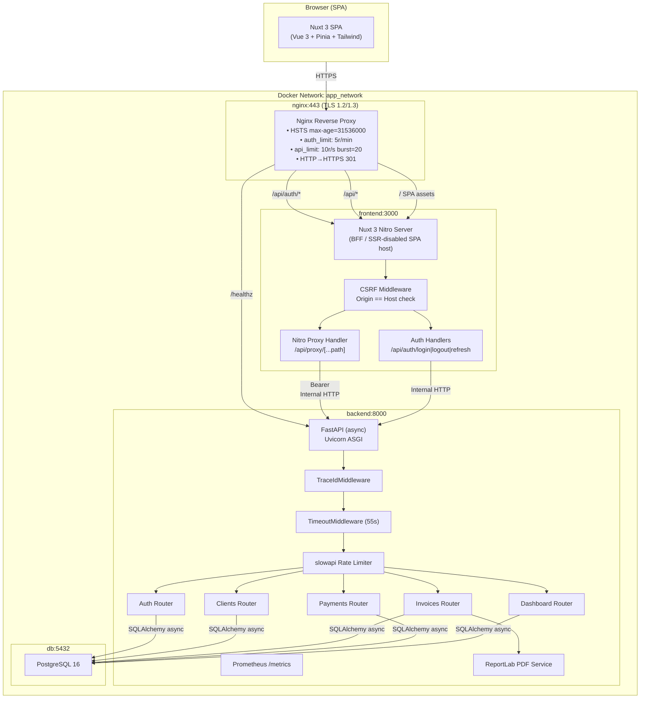
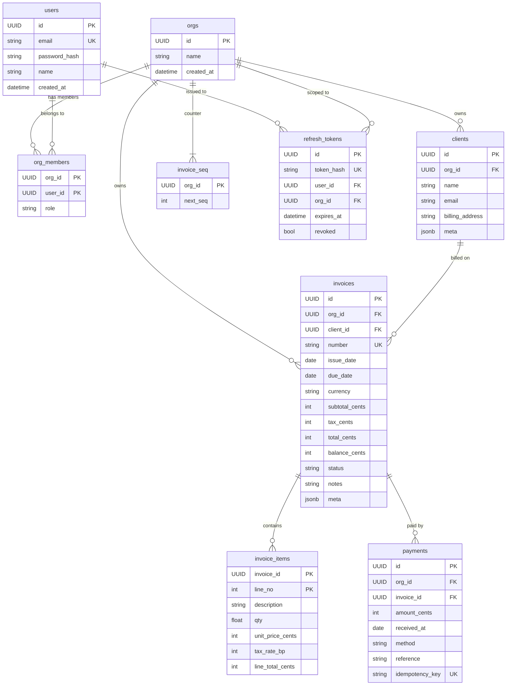
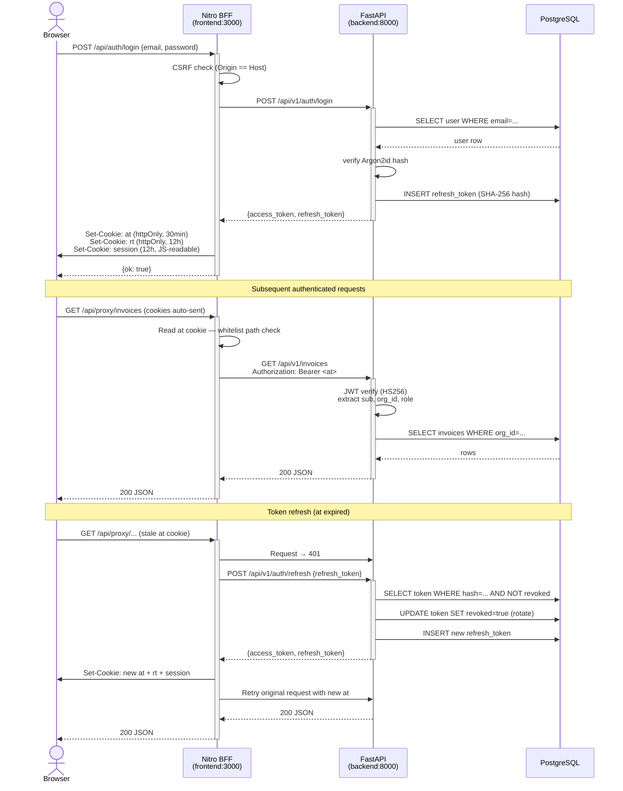
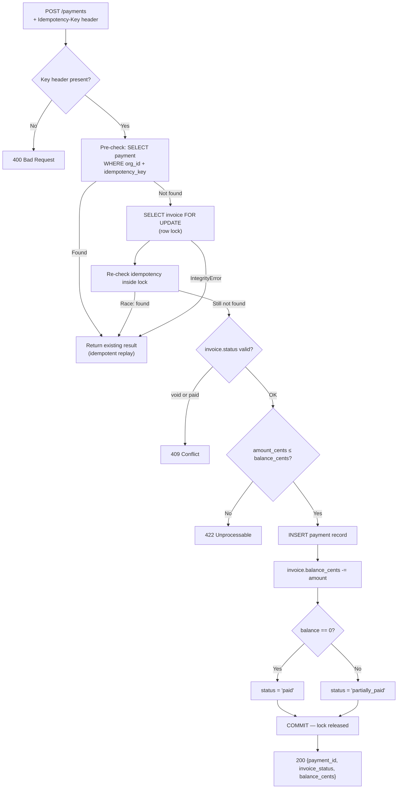
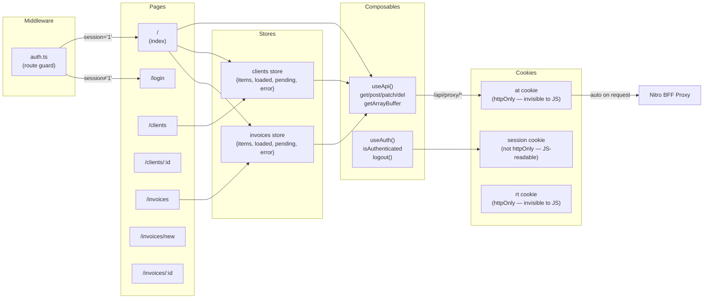
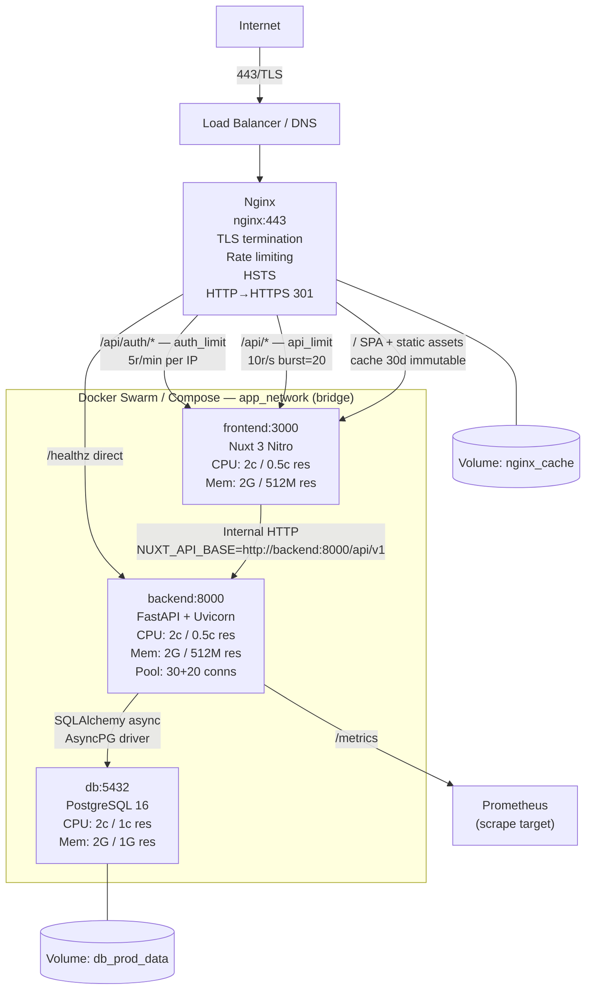
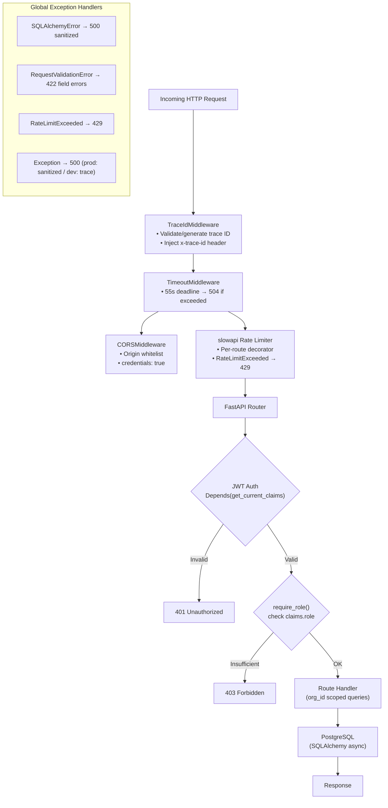
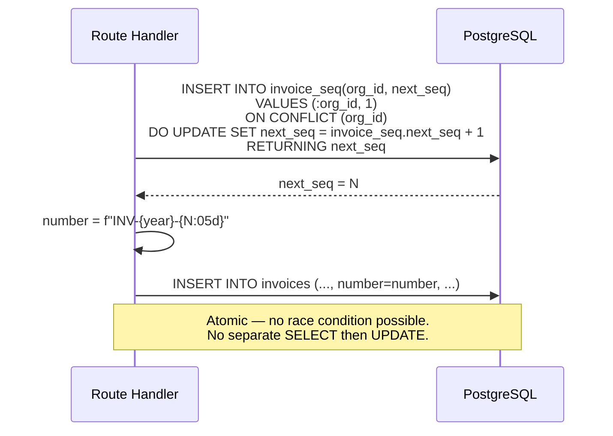

# Invoice Tracker — System Architecture

## 1. High-Level System Architecture

---

## 2. Database Schema (Entity-Relationship)

---

## 3. Authentication & Token Lifecycle

---

## 4. Payment Idempotency & Concurrency Flow

---

## 5. Frontend Routing & State Architecture

---

## 6. Infrastructure Topology (Production)

---

## 7. Request Middleware Stack (FastAPI)

---

## 8. Invoice Number Generation (Atomic Sequence)

---

## Key Design Decisions

| Concern | Solution |
|---|---|
| **Multi-tenancy** | Every table row carries `org_id`; JWT embeds `org_id`; every query scopes by it |
| **Token security** | `at` in `httpOnly` cookie (no JS access); `session` flag readable for route guards; refresh tokens stored as SHA-256 hash |
| **Payment idempotency** | `(org_id, idempotency_key)` unique constraint + `SELECT FOR UPDATE` row lock prevents double-charge under concurrency |
| **Money precision** | Integer cents throughout; `Decimal` + `ROUND_HALF_UP` for tax accumulation before insert |
| **CSRF protection** | Nitro server middleware enforces `Origin == Host` on all state-changing requests |
| **Rate limiting** | Dual-layer: Nginx (IP-level, 5r/min auth / 10r/s API) + slowapi (app-level, per-route) |
| **Open proxy prevention** | Nitro proxy validates path against explicit whitelist before forwarding to FastAPI |
| **Observability** | Trace IDs propagated end-to-end via `x-trace-id`; Prometheus `/metrics`; structured JSON logs in production |
| **PDF generation** | On-demand ReportLab rendering, streamed as `application/pdf` — no caching |
| **Invoice numbering** | `INSERT ... ON CONFLICT DO UPDATE RETURNING` — single atomic statement, no locks needed |
