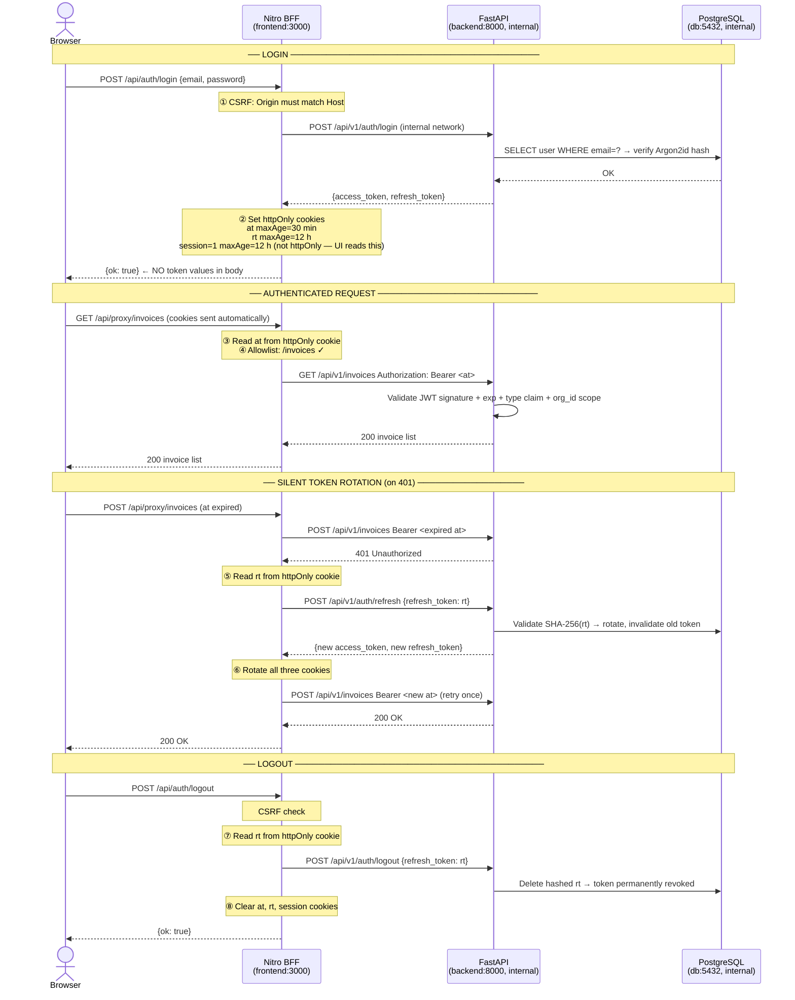
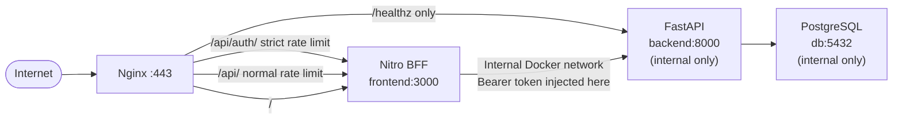
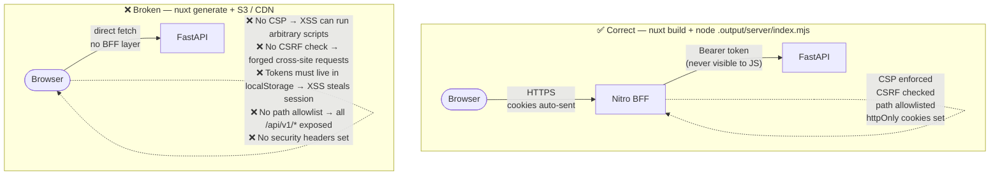

# Security Architecture

## Defense-in-Depth Overview

The app uses four layered security boundaries. A request must pass every layer in sequence; failing any layer terminates the request before it reaches the next.

```mermaid
flowchart TB
    Internet([Internet / Browser])

    subgraph L1["① Transport — Nginx (public edge)"]
        direction LR
        TLS["TLS 1.2 / 1.3 termination"]
        HSTS["HSTS  max-age=31 536 000"]
        HTTP_REDIR["HTTP → HTTPS 301 redirect"]
        RL_EDGE["Rate limits\n5 r/min auth · 10 r/s API"]
    end

    subgraph L2["② BFF — Nitro Server (frontend container)"]
        direction LR
        SEC_HDR["Security headers via nuxt-security\nCSP · X-Frame-Options · Referrer-Policy\nPermissions-Policy · X-Content-Type-Options"]
        CSRF["CSRF check\nOrigin header must match Host"]
        COOKIES["httpOnly cookie management\nat (30 min) · rt (12 h) · session indicator"]
        PATH_AL["Allowed-path allowlist\n/clients /invoices /payments /dash /auth/me only"]
        TOK_ROT["Transparent token rotation\n401 → refresh → retry (once, no loop)"]
    end

    subgraph L3["③ Application — FastAPI (backend container, internal only)"]
        direction LR
        JWT["JWT validation HS256\n+ type claim check"]
        ROLE["Role-based access\nOWNER enforced per org"]
        PYDANTIC["Pydantic v2 input validation\non every request body"]
        RL_APP["slowapi rate limit\n(configurable per env)"]
        TIMEOUT["55 s request timeout\n→ 504 before upstream hangs"]
        TRACE["Trace-ID sanitisation\nrejects injection via x-trace-id"]
    end

    subgraph L4["④ Data — PostgreSQL (db container, internal only)"]
        direction LR
        PW["Passwords: Argon2id hash\nnever stored plaintext"]
        RT_HASH["Refresh tokens: SHA-256 hash\nnever stored plaintext"]
        CONCUR["Payments: SELECT FOR UPDATE\nprevents double-payment race"]
    end

    Internet -->|"HTTPS only"| L1
    L1 -->|"/api/auth/* and /api/proxy/*\nproxied to Nitro"| L2
    L2 -->|"Internal HTTP + Bearer token\n(never sent to browser)"| L3
    L3 --> L4
```

---

## What Each Layer Defends Against

| Threat | Mitigated at |
|---|---|
| Eavesdropping / MITM | Layer 1 — TLS 1.2/1.3 + HSTS |
| Credential brute-force | Layer 1 — 5 r/min Nginx rate limit on `/api/auth/` |
| Clickjacking | Layer 2 — `X-Frame-Options: DENY` |
| XSS script injection | Layer 2 — CSP `script-src 'self'` + build-time SHA-256 hashes (nuxt-security SSG) |
| CSRF | Layer 2 — Origin/Host header check + `SameSite=Lax` cookies |
| Token theft via JS | Layer 2 — `at` and `rt` cookies are `httpOnly`; JS cannot read them |
| Open proxy / path traversal | Layer 2 — path allowlist; only 5 prefixes permitted |
| Replay / session fixation | Layer 2 — refresh token rotation on every use |
| Unauthenticated API access | Layer 3 — JWT required on every protected route |
| Cross-tenant data access | Layer 3 — every query scoped to `org_id` from JWT claims |
| Injection (SQL, etc.) | Layer 3 — Pydantic v2 + SQLAlchemy ORM parameterised queries |
| Oversized payloads / DoS | Layer 3 — 55 s timeout + slowapi rate limit |
| Log injection | Layer 3 — trace-ID regex validates `[a-zA-Z0-9_\-]{1,64}` |
| Plaintext credential leak | Layer 4 — Argon2id; even full DB dump cannot recover passwords |
| Plaintext token leak | Layer 4 — refresh tokens stored as SHA-256 hash |
| Payment double-charge | Layer 4 — `SELECT FOR UPDATE` row lock per invoice |

---

## Authentication Token Flow

---

## Nginx Routing — Why the Backend Is Never Publicly Reachable

In production (`docker-compose.prod.yml`) the backend container uses `expose` (internal only), not `ports`. Nginx is the only public entry point. The routing rules ensure the backend is never directly reachable:

`/api/v1/*` is **never exposed through nginx**. The only way to reach the FastAPI backend from outside is through Nitro, which enforces CSRF checks, httpOnly cookie auth, and the path allowlist first.

---

## Why Static Deployment Breaks Security

The static deployment does **not** make the backend insecure in isolation — JWT validation, Argon2, and rate limiting still function. What breaks is the **browser-side security posture**: there is no server to set httpOnly cookies, enforce CSRF, or send CSP headers. Tokens stored in JavaScript-accessible storage can be stolen by any XSS vector.

**Always deploy with the Nitro server running.**

---

## Security Header Responsibility Matrix

| Header | Set by | Notes |
|---|---|---|
| `Strict-Transport-Security` | Nginx | Nginx is the TLS terminator; this header belongs here |
| `Content-Security-Policy` | nuxt-security (Nitro) | Build-time script hashes via `ssg.hashScripts: true` |
| `X-Frame-Options` | nuxt-security (Nitro) | `DENY` — stricter than `SAMEORIGIN` |
| `X-Content-Type-Options` | nuxt-security (Nitro) | `nosniff` |
| `Referrer-Policy` | nuxt-security (Nitro) | `strict-origin-when-cross-origin` |
| `Permissions-Policy` | nuxt-security (Nitro) | geolocation, camera, microphone all blocked |
| `X-XSS-Protection` | **nobody** | Deprecated; removed from all major browsers; `1; mode=block` can create reflected XSS vectors on legacy engines |

---

## Content Security Policy — Known Trade-offs

### `style-src 'unsafe-inline'`

The CSP includes `'unsafe-inline'` in `style-src`. This is a deliberate and documented trade-off:

**Reason:** Tailwind CSS uses a JIT (Just-In-Time) compiler that injects `<style>` elements at build time and runtime. These dynamic inline styles cannot be pre-hashed because their content is generated at build time per-page, not statically known at server startup.

**Why nonces do not help:** Nonces require SSR (server-side rendering) to inject a unique per-request value into the HTML. This application uses `ssr: false` (a Nitro-served SPA) so there is no per-request HTML rendering. The `nonce: false` setting in `nuxt.config.ts` documents this.

**Mitigation:** `unsafe-inline` applies only to `style-src`. `script-src` does **not** include `unsafe-inline` — script content is controlled via build-time SHA-256 hashes (`ssg.hashScripts: true`). The primary XSS vector (script injection) is therefore still blocked by CSP. Inline style injection is a lower-severity risk: it can enable clickjacking-style visual deception but cannot execute JavaScript.
